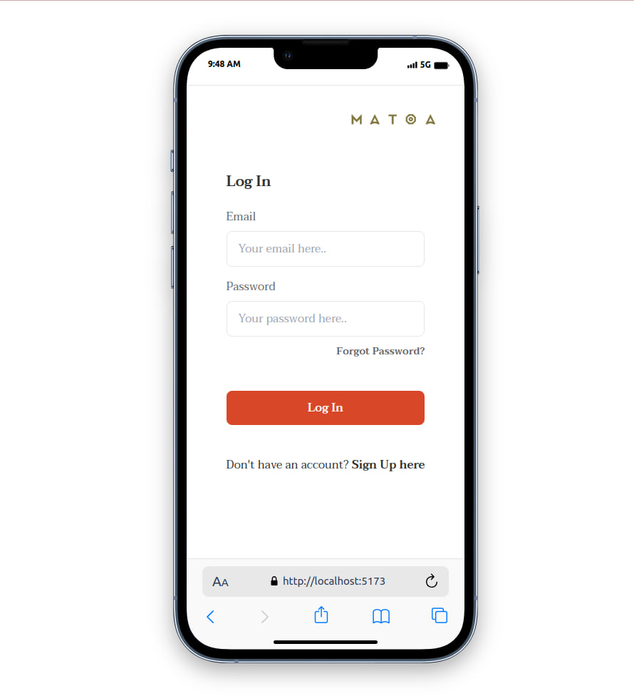
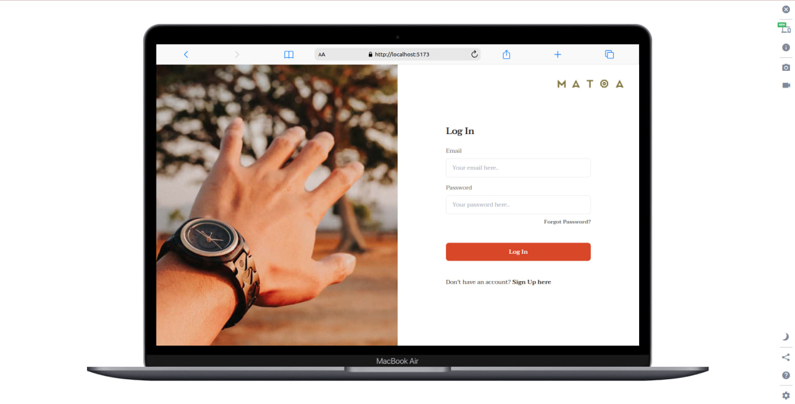
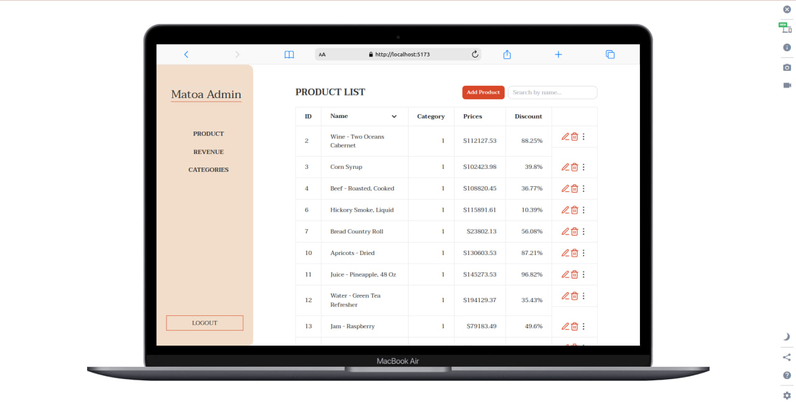

# Matoa Admin

A web application on the admin side that facilitates the management of products for an online shop website using React.

## Getting Started

First, run the backend server:

- open terminal and type `npm run server`
- open [http://localhost:3000](http://localhost:3000) with your browser to see the API.

Second, run the development server:

- open new terminal and type `npm install`
- then type `npm run dev`
- open [http://localhost:5173](http://localhost:5173) with your browser to see the result.

## Preview

